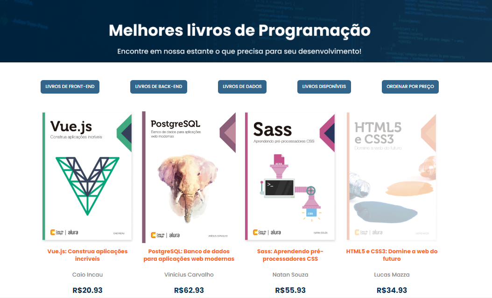

# Projeto Alurabooks - Estante

Projeto é a página de uma estante de livros de um site de vendas. Foi desenvolvida no curso métodos de array com JavaScript da Alura.

<strong>Objetivos: </strong>

- Utilizar os principais métodos de array do JavaScript: ForEach, Map, Filter, Sort e Reduce. 
- Consumir uma API
- Manipular o DOM

## 💻 Layout  

### Web

  

 ## 🔧 Tecnologias 

As tecnologias usadas foram: 
* HTML
* CSS
* JavaScript
